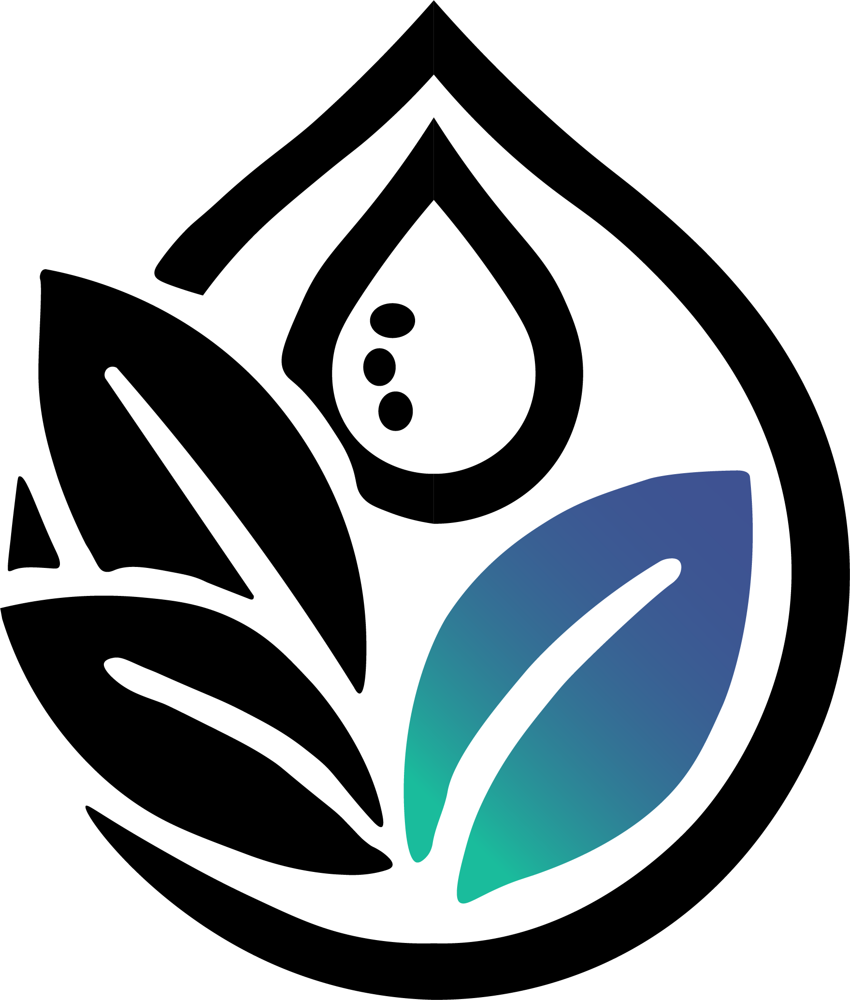

# Dermify - AI-Powered Skincare Analysis Platform



Dermify is a comprehensive web application that helps users analyze skincare products, learn about ingredients, build personalized routines, and perform AI-powered face analysis for skincare recommendations.

## ✨ Features

- **🔍 Product Analysis**: Detailed information about skincare products, including ingredients and reviews
- **🧪 Ingredients Database**: Comprehensive database of skincare ingredients with benefits and potential concerns
- **📅 Customized Routines**: Curated skincare routines for different skin types and concerns
- **🤖 Face Analysis**: AI-powered analysis to detect skin conditions and provide personalized recommendations
- **👤 User Accounts**: Personalized experience with saved products, routines and preferences
- **🌙 Dark/Light Modes**: Comfortable viewing experience in any lighting condition
- **🌐 Multi-language Support**: Currently supports English and Romanian

## 🛠️ Tech Stack

- **Frontend**: Next.js 14, React 18, Tailwind CSS 4
- **AI/ML**: TensorFlow.js, YOLOv8 (Python API)
- **Authentication**: Next.js App Router with JWT
- **Database**: Redis (via Upstash, can be replaced with a full database)
- **Styling**: Tailwind CSS with dark mode support
- **Deployment**: Vercel (frontend), Python backend for YOLO model

## 🚀 Getting Started

### Prerequisites

- Node.js 18+ 
- Python 3.8+ (for the YOLOv8 model API)
- Redis server (optional, or you can use Upstash)

### Installation

1. Clone the repository:
   ```powershell
   git clone https://github.com/yourusername/dermify.git
   cd dermify
   ```

2. Install JavaScript dependencies:
   ```powershell
   npm install
   ```

3. Set up Python environment for face analysis:
   ```powershell
   # Create a virtual environment (optional but recommended)
   python -m venv venv
   .\venv\Scripts\Activate.ps1
   
   # Install required packages
   pip install -r requirements.txt
   ```

4. Configure environment variables:
   - Copy `.env.local.example` to `.env.local` (or create a new file)
   - Update Redis connection details if needed

5. Start the development server:
   ```powershell
   npm run dev
   ```

6. Open [http://localhost:3000](http://localhost:3000) with your browser to see the result.

### AI Face Analysis Setup

The face analysis feature requires a YOLOv8 model and Python backend:

1. Make sure Python and required packages are installed:
   ```powershell
   pip install ultralytics fastapi uvicorn python-multipart pillow
   ```

2. YOLOv8 model file (`best.pt`) should be placed in one of these locations:
   - Primary location: `/api/best.pt`
   - Alternative location: `/public/models/best.pt`
   
3. The Next.js application will automatically start the Python API when needed

## 📁 Project Structure

- `app/` - Next.js App Router pages and layouts
  - `api/` - API routes for authentication, products, and skin analysis
  - `concerns/` - Skin concerns pages
  - `ingredients/` - Ingredients database pages
  - `products/` - Products catalog pages
  - `routines/` - Skincare routines pages
  - `skin-analysis/` - AI-powered skin analysis pages
- `components/` - Reusable React components
- `context/` - React context providers (theme, locale, loading)
- `public/` - Static assets
  - `models/` - AI model files
- `api/` - Python API for face analysis with YOLOv8
- `data/` - Static data files
- `lib/` - Utility functions and helpers
- `hooks/` - Custom React hooks
- `locales/` - Language translations

## 📱 Main Pages

- **Home** (`/`) - Landing page with feature highlights
- **Products** (`/products`) - Browse all skincare products
- **Ingredients** (`/ingredients`) - Browse skincare ingredients database
- **Skin Concerns** (`/concerns`) - Explore different skin concerns and solutions
- **Routines** (`/routines`) - View curated skincare routines
- **Skin Analysis** (`/skin-analysis`) - Analyze your skin with AI
- **Account** (`/account/profile`) - User profile and settings
- **Authentication** - Sign in (`/signin`) and sign up (`/signup`) pages

## 🧑‍💻 Development

### Environment Variables

Create a `.env.local` file in the root directory with the following variables:

```
# Redis configuration
REDIS_HOST=localhost
REDIS_PORT=6379
# REDIS_PASSWORD=your_password_if_needed

# Optional: Upstash Redis configuration
# UPSTASH_REDIS_REST_URL=your-upstash-url
# UPSTASH_REDIS_REST_TOKEN=your-upstash-token
```

### Available Scripts

- `npm run dev` - Start development server
- `npm run build` - Build for production
- `npm run start` - Start production server
- `npm run lint` - Run ESLint to check for code quality
- `node scripts/importProducts.js` - Import products from CSV to the products data module

## 📚 API Routes

### Authentication

- `POST /api/auth/signup` - Register a new user
- `POST /api/auth/signin` - Log in a user
- `GET /api/auth/check-auth` - Check authentication status
- `POST /api/auth/signout` - Log out a user

### Products & Ingredients

- `GET /api/products` - Get all products (with optional filters)
- `GET /api/products/[id]` - Get a specific product by ID
- `GET /api/user/profile` - Get user profile data
- `PUT /api/user/profile/update` - Update user profile

### Skin Analysis

- `POST /api/skin-analysis/analyze` - Analyze a skin image 
- `GET /api/skin-analysis/history` - Get user's analysis history
- `GET /api/yolo-status` - Check YOLOv8 API status

## 🌐 Python YOLO API

The YOLOv8 API provides the following endpoints:

- `POST /analyze` - Analyze a skin image and detect skin conditions
- `GET /` - Health check and API information

## 🤝 Contributing

Contributions are welcome! Please follow these steps:

1. Fork the repository
2. Create your feature branch: `git checkout -b feature/amazing-feature`
3. Commit your changes: `git commit -m 'Add some amazing feature'`
4. Push to the branch: `git push origin feature/amazing-feature`
5. Open a Pull Request

## 📄 License

This project is licensed under the MIT License - see the LICENSE file for details.

## 📝 Roadmap

- [ ] Add support for additional languages
- [ ] Implement product recommendation system
- [ ] Develop mobile app version
- [ ] Add camera support for real-time analysis
- [ ] Integrate with e-commerce platforms

## 👥 Authors

- **Your Name** - *Initial work* - [YourGitHub](https://github.com/yourusername)

## 🙏 Acknowledgments

- YOLOv8 and Ultralytics for the computer vision capabilities
- Next.js team for the amazing React framework
- All open-source contributors
